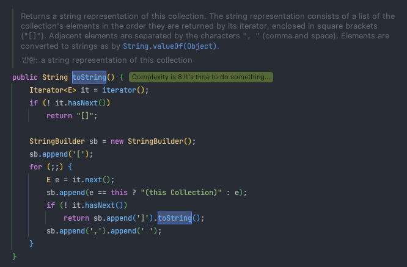
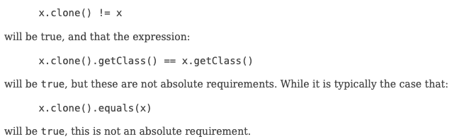

# 3장 모든 객체의 공통 메서드

<aside>
📌 Item 10~14를 읽고, 공부한 내용을 정리합니다.

</aside>

> Object 클래스는 객체를 만들 수 있는 구체 클래스이지만 기본적으로 상속해서 사용하도록 final이 아닌 메서드(equals, hashCode, toString, clone, finalize)는 모두 재정의(overriding)을 염두에 두고 설계되었다. 일반 규약에 맞게 재정의하지 않으면 HashMap, HashSet 등의 클래스를 오동작하게 만들 수 있다.
> 

---

## Item 10. equals는 일반 규약을 지켜 재정의하라

### 재정의하지 않는 것이 최선인 경우

- 각 인스턴스가 본질적으로 고유하다. (= 표현X, 동작O 개체)
- 인스턴스의 ‘논리적 동치성(logical equality)’을 검사할 일이 없다.
- 상위 클래스에서 재정의한 equals가 하위 클래스에도 딱 들어맞는다.
- 클래스가 private이거나 package-private이고 equals 메서드를 호출할 일이 없다.
    
    ```java
    // 위험을 회피하기 위해 아래와 같이 재정의하여 호출을 금지시킴.
    @Override public boolean equals(Object o) {
    		throw new AssertionError();
    }
    ```
    
- 값 클래스 중 아래의 경우는 기존의 equals가 논리적 동치성과 객체 식별성을 동시에 확인한다.
    - 값이 같은 인스턴스가 둘 이상 만들어지지 않음을 보장하는 인스턴스 통제 클래스 (Item 1)
    - Enum (Item 34)

### Object 명세에 적힌 equals 일반 규약

equals는 동치관계(equivalence realation)을 구현하며,

null이 아닌 모든 참조 값에 대해,

- 반사성(reflexivity) : x.equals(x) == true
- 대칭성(symmetry) : if x.equals(y) → y.equals(x) == true
    - 대칭성을 어기는 경우
        
        → equals 규약을 어기면 그 객체를 사용하는 다른 객체들이 어떻게 반응할지 알 수 없다!!
        
        ```java
        public final class CaseInsensitiveString {
            private final String s;
        
            public CaseInsensitiveString(String s) {
                this.s = Objects.requireNonNull(s);
            }
        
            // 대칭성 위배
            @Override
            public boolean equals(Object o) {
                if (o instanceof CaseInsensitiveString)
                    return s.equalsIgnoreCase(((CaseInsensitiveString) o).s);
                // CaseInsensitiveString은 String을 알지만,
                // String은 CaseInsensitiveString을 알지 못함.
                if (o instanceof String)
                    return s.equalsIgnoreCase((String) o);
                return false;
            }
        
            public static void main(String[] args) {
                CaseInsensitiveString cis = new CaseInsensitiveString("Polish");
                String s = "polish";
        
                System.out.println("cis.equals(s) => " + cis.equals(s));
                System.out.println("s.equals(cis) => " + s.equals(cis));
        
                // 출력
                // cis.equals(s) => true
                // s.equals(cis) => false
        
                List<CaseInsensitiveString> list = new ArrayList<>();
                list.add(cis);
        
                System.out.println("list.contains(cis) => " + list.contains(cis));
                System.out.println("list.contains(s) => " + list.contains(s));
        
                // 출력
                // list.contains(cis) => true
                // list.contains(s) => false
            }
        }
        ```
        
- 추이성(transitivity) : if x.equals(y) && y.equals(z) → x.equals(z)
    - 추이성을 어기는 경우
        - 구체 클래스를 확장해 새로운 값을 추가하면서 equals 규약을 만족시킬 방법을 존재하지 않는다.
        - instanceof 대신 getClass 검사로 바꾸면 리스코프 치환 원칙을 위배하게 된다.
            - 코드
                
                ```java
                class Point {
                    private final int x;
                    private final int y;
                
                    public Point(int x, int y) {
                        this.x = x;
                        this.y = y;
                    }
                
                    @Override
                    public boolean equals(Object o) {
                        if (!(o instanceof Point))
                            return false;
                        Point p = (Point) o;
                        return p.x == x && p.y == y;
                    }
                }
                
                class ColorPoint extends Point {
                    private final Color color;
                
                    public ColorPoint(int x, int y, Color color) {
                        super(x, y);
                        this.color = color;
                    }
                
                    @Override
                    public boolean equals(Object o) {
                        if (!(o instanceof Point))
                            return false;
                
                        // ((ColorPoint) o).color == color의 대칭성 위배를 해결한다.
                        // o가 일반 Point라면 색상을 무시하고 Point의 equals로 비교한다.
                        if (!(o instanceof ColorPoint))
                            return o.equals(this);
                
                        return super.equals(o) && ((ColorPoint) o).color == color;
                    }
                }
                
                class SmellPoint extends Point {
                    private final String smell;
                
                    public SmellPoint(int x, int y, String smell) {
                        super(x, y);
                        this.smell = smell;
                    }
                
                    @Override
                    public boolean equals(Object o) {
                        if (!(o instanceof Point))
                            return false;
                
                        // 다른 Point에서 같은 동작을 실행해 무한 재귀에 빠짐
                        if (!(o instanceof SmellPoint))
                            return o.equals(this);
                
                        return super.equals(o) && ((SmellPoint) o).smell.equals(smell);
                    }
                }
                
                class Test {
                
                    public static void main(String[] args) {
                        Point p = new Point(1, 2);
                        ColorPoint cp = new ColorPoint(1, 2, Color.RED);
                
                        System.out.println("p.equals(cp) => " + p.equals(cp));
                        System.out.println("cp.equals(p) => " + cp.equals(p));
                
                        // 대칭성 위배 출력
                        // p.equals(cp) => true
                        // cp.equals(p) => false
                
                        // 대칭성 지키고, 추이성 위배한 출력
                        // p.equals(cp) => true
                        // cp.equals(p) => true
                
                        ColorPoint p1 = new ColorPoint(1, 2, Color.RED);
                        Point p2 = new Point(1, 2);
                        ColorPoint p3 = new ColorPoint(1, 2, Color.BLUE);
                
                        // p1 <-> p2, p2 <-> p3는 Point인 p2로 인해 색상을 제외한 비교를 함
                        // p1 <-> p3는 색상까지 비교하여 추이성 위배
                        System.out.println("p1.equals(p2) => " + p1.equals(p2));
                        System.out.println("p2.equals(p3) => " + p2.equals(p3));
                        System.out.println("p1.equals(p3) => " + p1.equals(p3));
                
                        // 출력
                        // p1.equals(p2) => true
                        // p2.equals(p3) => true
                        // p1.equals(p3) => false
                
                        ColorPoint myColorPoint = new ColorPoint(1, 2, Color.PINK);
                        SmellPoint mySmellPoint = new SmellPoint(1, 2, "flower");
                
                        myColorPoint.equals(mySmellPoint);
                
                        // 예외 발생
                        // Exception in thread "main" java.lang.StackOverflowError
                        //	at ColorPoint.equals(Point.java:43)
                        //	at SmellPoint.equals(Point.java:63)
                    }
                }
                ```
                
        - 구체 클래스의 하위 클래스에서 값을 추가하는 우회 방법
            
            = 상속 대신 컴포지션을 사용 + 구체 클래스 반환하는 뷰(View) 메서드 추가
            
            <aside>
            ⚠️ 컴포지션의 예로 java.sql.Timestamp가 있으나 설계 실수로 인해 상위 클래스인 Date의 인스턴스와 함께 사용하면 이상한 오류를 발생시킬 수 있음
            
            </aside>
            
- 일관성(consistency) : x.equals(y)를 반복해 호출하면 항상 true거나 항상 false여야 한다.
    - 클래스가 불변이든 가변이든 equals의 판단에 신뢰할 수 없는 자원을 끼어들게 해서는 안된다.
        
        = 메모리에 존재하는 객체만을 사용한 결정적(deterministic) 계산만 수행해야 한다.
        
- null-아님 : x.equals(null) == false
    - 명시적 null 검사를 하지 않아도 된다.

### 양질의 equals 메서드 구현 방법

1. == 연산자를 사용해 입력이 자기 자신의 참조인지 확인
2. instanceof 연산자로 입력이 올바른 타입인지 확인 (null instanceof ?? 라면 NullPointerException을 던지기 때문에 null 검증은 필요 없음)
3. 입력을 올바른 타입으로 형변환
4. 입력 객체와 자기 자신의 대응되는 ‘핵심’ 필드들이 모두 일치하는지 하나씩 검사

### 구현 후 자문 세 가지

1. 대칭적인가?
2. 추이성이 있는가?
3. 일관적인가

⇒ 자문 후 단위 테스트를 작성해 다시 확인하기! ⇒ 구글’s AutoValue 프레임워크 활용

### 주의사항

- equals를 재정의할 땐 hashCode도 반드시 재정의하자
- 복잡하게 별칭, 같은 파일인지? 와 같은 시도는 하지 말자
- Object 타입의 equals 메서드를 재정의하자 (=@Override 잘 쓰자) → 아니면 긍정오류, 보안문제 발생

---

## Item 11. equals를 재정의하려거든 hashCode도 재정의하라

<aside>
🔥 equals를 재정의한 클래스 모두에서 hashCode도 재정의해야 한다.

</aside>

### Object 명세에서 발췌한 규약

- equals 비교에 사용되는 정보가 변경되지 않는다면, hashCode는 일관적인 값을 반환해야 한다.
- equals에서 같은 객체로 판단되면, hashCode도 같은 값을 반환해야 한다.
- equals에서 다른 객체로 판단했다해서, hashCode가 서로 다른 값을 반환할 필요는 없다.

### equals만 재정의한 경우

```java
public class PhoneNumber {
    int first;
    int second;
    int third;

    public PhoneNumber(int first, int second, int third) {
        this.first = first;
        this.second = second;
        this.third = third;
    }

    @Override
    public boolean equals(Object o) {
        if (this == o) {
            return true;
        }
        if (!(o instanceof PhoneNumber)) {
            return false;
        }
        PhoneNumber that = (PhoneNumber) o;
        return first == that.first && second == that.second && third == that.third;
    }
}

class Test {
		public static void main(String[] args) {
        Map<PhoneNumber, String> m = new HashMap<>();
        m.put(new PhoneNumber(10, 1234, 5678), "홍길동");

        System.out.println(m.get(new PhoneNumber(10, 1234, 5678)));

				// 출력
				// null
    }
}
```

- 두 객체가 서로 다른 해시코드를 반환 == 서로 다른 해시 버킷에 담김
    - 엉뚱한 해시 버킷에서 객체를 찾는 상황 발생
- 같은 해시 버킷에 담겼다고 해도 HashMap은 해시코드가 다른 엔트리끼리는 동치성 비교를 하지 않도록 최적화되어 있음

!! 주의 !! 

동치인 모든 객체에 같은 hashCode를 반환하면 모든 객체가 해시 테이블의 버킷 하나에 담겨 연결리스트처럼 동작하게 되므로 절대 이 방식은 사용하면 안된다 (O(1)인 hashMap을 O(n)으로 만들 수 있다)

### 좋은 hashCode를 작성하는 요령

1. int 변수 result를 선언하여 첫 핵심 필드의 hashCode로 초기화
2. 나머지 핵심 필드들에 대해 `result = 31 * result + 핵심필드의 hashCode` 를 수행
    1. primitive type
        1. 박싱클래스.hashCode(값)
    2. reference type
        1. 필드의 hashCode를 재귀적으로 호출
        2. 복잡할 경우, 필드의 표준형(canonical representation)을 만들어 호출
        3. null은 0으로 대체
    3. 배열
        1. 원소 각각을 필드처럼 다룸 → 핵심 원소를 다룸
        2. 배열에 핵심 원소하나도 없으면 단순 상수(ex. 0) 사용
        3. 모든 원소가 핵심 원소라면 Arrays.hashCode를 사용
3. 단위 테스트 작성하여 검증 (AutoValue 사용하면 생략해도 OK)
- *예시 코드*
    
    ```java
    @Override
        public int hashCode() {
            int result = Integer.hashCode(first);
            result = 31 * result + Integer.hashCode(second);
            result = 31 * result + Integer.hashCode(third);
            return result;
        }
    ```
    

(+) 추가

- 파생 필드는 계산하지 않아도 됨
- 31을 곱하는 이유는 홀수이면서 소수(prime)이기 때문
    
    (짝수로 곱하면 shift 연산과 같은 결과를 냄)
    
- Objects.hash()로도 간단하게 가능하나 내부에서 박싱, 언박싱을 하기 때문에 더 느림
- 위 방법보다 더 적은 해시 충돌을 원한다면 com.google.common.hash.Hashing[Guava] 참고

### hashCode 계산 비용이 크다면?

캐싱? 지연 초기화(lazy initialization)?

만약 지연 초기화 방식을 사용하고자 한다면 스레드를 안정하게 만들도록 신경써야 한다.

```java
private int hashCode;

@Override
public int hashCode() {
    int result = hashCode;
    if (result == 0) {
        result = Integer.hashCode(first);
        result = 31 * result + Integer.hashCode(second);
        result = 31 * result + Integer.hashCode(third);
    }
    return result;
}
```

**[ 주의 ]**

- 성능을 높이기 위해 핵심 필드를 제외하고 hashCode를 계산해서는 안된다. 계산 속도는 빨라지겠지만 해시 품질이 나빠져 해시 테이블의 성능을 심각하게 떨어뜨릴 수 있다.
- hashCode가 반환하는 값의 생성 규칙을 API 사용자에게 자세히 공표하면 추후에 계산 방식을 바꿀 때 이에 의지한 클라이언트가 있는 경우엔 문제가 생길 수 있다.

---

## Item 12. toString을 항상 재정의하라

### 간결하면서 사람이 읽기 쉬운 형태의 유익한 정보를 반환해라

> toString의 일반 규약 - “모든 하위 클래스에서 이 메서드를 재정의하라”
> 
- 잘 구현한 클래스는 사용하기에 훨씬 즐겁고, 디버깅이 쉽다.
    - println, printf, 문자열 연결 연산자(+), assert 구문, 디버거의 객체 출력 시에 호출됨
- 객체가 가진 주요 정보 모두를 반환하는 것이 좋다.
- 반환값의 포맷을 문서화할지 정해야 한다.
    - 장점 : 포맷을 명시하면 표준적이고, 명확하고, 사람이 읽기 좋은 반환이 된다. 또한, 명시한 포맷에 맞는 문자열과 객체를 상호 전환할 수 있는 정적 팩토리나 생성자를 함께 제공해주면 좋다.
    - 단점 : 포맷을 한번 명시하면 평생 그 포맷에 얽매이게 된다.
    - 포맷을 명시하든 아니든 의도가 명확해야 한다.
        
        ```java
        // 명시하는 경우
        // 출력 : 111-222-3333
        @Override public String toString() {
        		return String.format("%03d-%03d-%04d", areaCode, prefic, lineNum);
        }
        
        // 명시하지 않는 경우
        // 출력 : [사람 #1: 성별=여, 키=000, 몸무게=00]
        ```
        
- 반환 값에 포함된 정보를 얻어올 수 있는 API를 제공하자.
    - 제공하지 않는다면 toString을 파싱하여 정보를 얻어야 된다.
    - ??? ⇒ 접근자를 제공하지 않으면 (변경할 수 있다고 문서화했더라도) 그 포맷이 사실상 준-표준 API나 다름없어진다. … 준 표준 API가 뭐지?
- 정적 유틸리티 클래스는 toString을 제공할 이유가 없다.
- 대부분의 열거 타입도 따로 재정의할 필요가 없다.
- 하위 클래스들이 공유해야 할 문자열 표현이 있는 추상 클래스라면 toString을 재정의해줘야 한다.
    - 대대수의 컬렉션 구현체는 추상 컬렉션 클래스들의 toString 메서드를 상속해 쓴다.
        
        Ex) ArrayList 기준
        
        1. `public class **ArrayList<E>** extends AbstractList<E> implements List<E>, RandomAccess, Cloneable, java.io.Serializable {}` 
        2. `public abstract class **AbstractList<E>** extends AbstractCollection<E> implements List<E> {}`
        3. `public **abstract class AbstractCollection<E>** implements Collection<E> {}`
            1. AbstractCollection의 toString에 공유해야 할 문자열 표현이 재정의되어 있다.
            
            
            
- 구글의 AutoValue 프레임워크도 이를 생성해 주지만, ‘의미’를 파악하지는 못한다.

---

## Item 13. clone 재정의는 주의해서 진행하라

### [Cloneable](https://docs.oracle.com/javase/8/docs/api/java/lang/Cloneable.html)??

- mixed interface (복제해도 되는 클래스임을 명시)
- 문제점 : [clone](https://docs.oracle.com/javase/8/docs/api/java/lang/Object.html#clone--) 메서드가 선언된 곳이 Cloneable이 아닌 Object 클래스이며, 이마저도 protected로 되어 있다. 리플렉션을 사용하면 가능하지만, 100% 성공은 아니다.
- 역할 : Object의 protected인 clone 메서드의 동작 방식을 결정한다.
    - Cloneable 인터페이스를 구현한 클래스의 인스턴스는 clone 메서드를 호출하면 객체의 필드 하나하나를 복사한 객체를 반환한다.
    - 그렇지 않으면, CloneNotSupportedException을 던진다.
- 일반적인 인터페이스 구현은 인터페이스에 정의한 기능을 선언하는 행위이지만, Cloneable의 경우에는 상위 클래스의 동작 방식을 변경한 것이다.
    
    ```java
    // CloneTest에 Cloneable 구현을 하지 않은 경우
    class CloneTest {
        int first;
    
        public CloneTest(int first) {
            this.first = first;
        }
    }
    
    public class Test {
        public static void main(String[] args) {
            CloneTest t1 = new CloneTest(1);
            t1.clone();
        }
    }
    
    // 결과
    // java: clone() has protected access in java.lang.Object
    ```
    
    ```java
    // CloneTest에 Cloneable을 구현한 경우
    class CloneTest implements Cloneable {
        int first;
    
        public CloneTest(int first) {
            this.first = first;
        }
    
        @Override
        protected Object clone() throws CloneNotSupportedException {
            return super.clone();
        }
    }
    
    public class Test {
        public static void main(String[] args) throws CloneNotSupportedException {
            CloneTest t1 = new CloneTest(1);
            CloneTest t2 = (CloneTest) t1.clone();
    
            System.out.println("t1 == t2 : " + (t1 == t2));
            System.out.println("t1.first : " + t1.first);
            System.out.println("t2.first : " + t2.first);
        }
    }
    
    // 결과
    // t1 == t2 : false
    // t1.first : 1
    // t2.first : 1
    ```
    

### 허술한 clone 메서드의 일반 규약



Oracle 공식문서의 clone() 설명

- 위 규약은 강제성이 없다는 점만 빼면 생성자 연쇄(constructor chaining)과 살짝 비슷한 매커니즘이다. 컴파일러는 super.clone과 생성자를 구분하여 불평하지 않는다. final 클래스라면 상관 없지만, 아래와 같이 Flower 클래스에서 clone을 생성자로 반환하게 하면 Flower를 상속받는 Daisy 클래스는 super.clone을 해도 Flower 생성자로 반환을 받게 된다.
    
    ```java
    class Flower implements Cloneable {
        Color color;
    
        public Flower(Color color) {
            this.color = color;
        }
    
        @Override
        public Object clone() throws CloneNotSupportedException {
            return new Flower(color);
        }
    }
    
    class Daisy extends Flower implements Cloneable {
        public Daisy(Color color) {
            super(color);
        }
    
        @Override
        public Object clone() throws CloneNotSupportedException {
            return super.clone();
        }
    }
    
    public class FlowerCloneTest {
        public static void main(String[] args) throws CloneNotSupportedException {
            Flower flower1 = new Flower(Color.PINK);
            Object flower2 = flower1.clone();
            System.out.println("flower1.getClass() : " + flower1.getClass());
            System.out.println("flower2.getClass() : " + flower2.getClass());
    
            Daisy daisy1 = new Daisy(Color.WHITE);
            Object daisy2 = daisy1.clone();
            System.out.println("daisy1.getClass() : " + daisy1.getClass());
            System.out.println("daisy2.getClass() : " + daisy2.getClass());
        }
    }
    ```
    
- 불변 클래스는 쓸데없는 복사를 지양하기 위해 굳이 clone 메서드를 제공하지 않는게 좋다.
    
    ```java
    @Override pulbic PhoneNumber clone() {
    		try {
    				// 공변 반환 타이핑 (covariant return typing)
    				return  (PhoneNumber) super.clone();
    		} catch (CloneNotSupportedException e) {
    				throw new AssertionError(); // 일어날 수 없는 일이다.
    		}
    }
    ```
    

### 가변 상태를 참조하는 클래스는 어떻게 clone을 구현해야 하는가

clone은 사실상 생성자와 같은 효과를 낸다. 즉, clone은 원본 객체에 아무런 해를 끼치지 않는 동시에 복제된 객체의 불변식을 보장해야 한다. 배열의 clone은 런타임과 컴파일 타임에 모두 같은 배열을 반환하기에 아래와 같이 구현해볼 수 있다.

```java
class Stack implements Cloneable {
    private Object[] elements;
    private int size;

    @Override
    public Stack clone() {
        try {
            Stack result = (Stack) super.clone();
            result.elements = elements.clone();
            return result;
        } catch (CloneNotSupportedException e) {
            throw new AssertionError();
        }
    }
}
```

만약, elements 필드가 final로 선언되어 있다면 위와 같이 구현할 수는 없다. final 필드에는 새로운 값을 할당 할 수 없기 때문에 clone을 구현하기 위해서는 일부 final 한정자를 제거해야 할 수도 있다. 

(Cloneable 아키텍처는 ‘가변 객체를 참조하는 필드는 final로 선언하라’는 일반 용법과 충돌한다)

### 가변 필드 내부에 가변 인자가 들어있다면?

예로 HashTable이 있다. Entry[] buckets 내부에 LinkedList와 유사하게 Chaining을 구현해본다고 가정한다. 이렇게 구현된 buckets 필드를 직접 clone하게 되면 결국 내부에 든 Chaining에 대한 정보 그대로 복사해 반환할 것이다. 이를 해결하는 일반적인 해법은 다음과 같다.

```java
public class HashTable implements Cloneable {
    private Entry[] buckets = ...;

    private static class Entry {

        final Object key;
        Object value;
        Entry next;

        public Entry(Object key, Object value, Entry next) {
            this.key = key;
            this.value = value;
            this.next = next;
        }

        // 연결된 리스트를 복사
        Entry deepCopy() {
						// 순회 방법 = 오버플로 방지
						Entry result = new Entry(key, value, next);
            for (Entry p = result; p.next != null; p = p.next) {
                p.next = new Entry(p.next.key, p.next.value, p.next.next);
            }
            return result;

						// 재귀 방법
						// return new Entry(key, value, next == null ? null : next.deepCopy());
        }
    }

    @Override
    public HahsTable clone() {
        try {
            HashTable result = (HashTable) super.clone();
            result.buckets = new Entry[buckets.length];
            for (int i = 0; i < buckets.length; i++) {
                if (buckets[i] != null) {
                    result.buckets[i] = buckets[i].deepCopy();
                }
            }
            return result;
        } catch (CloneNotSupportedException e) {
            throw new AssertionError();
        }
    }
}
```

### 고수준 메서드 호출 복제 방법

- super.clone을 호출해 얻은 객체의 모든 필드를 초기화하고, 원본 객체의 상태를 다시 생성하는 고수준 메서드를 호출한다. 고수준 메서드는 `put(key, value)` 와 같은 메서드를 말한다. 이 방식은 저수준 메서드보다 느리고 필드 단위 객체 복사를 우회하는 방식이기 때문에 Cloneable 아키텍처와는 어울리지 않는 방식이라 할 수 있다.
- clone은 생성자와 마찬가지로 재정의될 수 있는 메서드는 호출하지 않아야 한다. 따라서 위에서 언급한 `put(key,value)` 메서드는 private 혹은 final이어야 한다. private인 경우에는 public 메서드가 사용하는 도우미 메서드일 수 있다.

### 기억해둬야 하는 추가사항

- 재정의하여 public인 clone 메서드는 사용하기 편하게 하기 위해 throws 절을 없애야 한다.
- 상속용 클래스는 Cloneable을 구현해서는 안된다. 상속용 클래스는 Object의 방식을 모방해 하위 클래스에서 구현하게 하거나, 하위 클래스에서 재정의하지 못하게 clone을 퇴화시키는 방식을 선택해 사용할 수 있다.
- Cloneable을 구현한 스레드 안전(Thread-safe) 클래스를 작성할 때는 clone 메서드 역시 적절하게 동기화 시켜줘야 한다. 별다른 변경사항이 없더라도 구현해줘야 한다는 말이다.

### 간단 요약

1. Cloneable를 구현하는 모든 클래스는 clone을 재정의해야 한다.
    1. 접근제한자 = public, 반환타입 = class 자신
2. 가변 객체 필드가 있는 클래스라면 대상 클래스부터 내부 깊은 구조까지 모든 가변 객체를 복제해야 하고, 불변 객체와 기본 타입만 갖는 클래스라면 아무 필드도 수정하지 않아도 된다.
    1. 하지만, 일련번호와 같은 고유한 필드는 수정해줘야 한다.

### 복사 생성자와 복사 팩터리 (더 나은 객체 복사 방식)

```java
public class Student {
    private String name;
    private int age;
    private Set<String> subjects;
    
    // 복사 생성자
    public Student(Student student)
    {
        this.name = student.name;
        this.age = student.age;
        this.subjects = new HashSet<>(student.subjects);    // 딥 카피
    }

    // 복사 팩터리
    public static Student newInstance(Student student) {
        return new Student(student);
    }
}
```

- 복사 생성자 : 자신과 같은 클래스의 인스턴스를 인수로 받는 생성자 (=변환 생성자)
- 복사 팩터리 : 복사 생성자를 모방한 정적 팩터리 (=변환 팩터리)
- 장점
    - [ 언어 모순적, 위험천만한 객체 생성 매커니즘(생성자 사용 X), 엉성한 문서규약, 정상적인 final 용법 충돌, 불필요한 checked exception, 형변환 ] - 이 필요 없어진다.
    - 인터페이스 타입의 인스턴스를 인수로 받을 수 있다.
        - HashSet 객체를 TreeSet 객체로 변환하여 복제할 수 있다는 말이다.

---

## Item 14. Comparable을 구현할지 고려하라

### Comparable의 유일무이한 메서드 compareTo

```java
public interface Comparable<T> {
		int compareTo(T t);
}
```

- 단순 동치성 비교에 더해 순서까지 비교할 수 있고, 제네릭한 메서드
- Comparable 구현 == 자연적인 순서(natural order) 존재
- 사실상 자바 플랫폼 라이브러리의 모든 값 클래스와 열거 타입이 Comparable을 구현했다.

### compareTo의 일반 규약

- this와 주어진 객체를 비교해 아래와 같이 반환한다. (sgn = signum function)
    - 주어진 객체보다 작으면 음의 정수
    - 주어진 객체와 같으면 0
    - 주어진 객체보다 크면 양의 정수
- compareTo는 타입이 다른 객체를 신경쓰지 않아도 된다.
    - 다른 타입이 주어지면 ClassCastException을 던지면 된다.
    - 다른 타입 사이 비교를 허용하기도 하는데 보통 공통 인터페이스를 매개로 이루어진다.

compareTo 규약을 지키지 못하면 비교를 활용하는 클래스와 어울리지 못한다. 예로, TreeSet과 TreeMap, 유틸리티 클래스인 Collections와 Arrays가 있다.

Comparable을 구현한 클래스는 아래와 같은 일반 규약을 갖는다.

1. sgn(x.compareTo(y)) == -sgn(y.compareTo(x))
2. 추이성 보장 → x.compareTo(y) > 0 && y.compareTo(z) > 0이면 x.compareTo(z) > 0
3. if x.compareTo(y) == 0이면, sgn(x.compareTo(z)) == sgn(y.compareTo(z))
4. 필수는 아니지만 x.compareTo(y) == 0이면, x.equals(y)
    1. 이 규약이 필수가 아니라 지키지 않는다면, 정렬된 컬렉션에 해당 객체를 넣으면 컬렉션이 구현한 인터페이스에 정의된 동작과 엇박자를 낼 수 있다.
    2. 정렬된 컬렉션들은 동치성을 비교할 때 equals가 아닌 compareTo를 사용한다.

위 필수 3개의 규약은 equals 규약처럼 반사성, 대칭성, 추이성을 충족해야 함을 뜻한다. 

마찬가지로 주의 사항도 같기 때문에 구체 클래스에서 컴포넌트를 추가한다면 compareTo 규약을 지킬 수 없다. 우회법을 똑같이 적용시켜 상속보다 인스턴스를 가리키는 필드를 두어 해결해볼 수 있다.

### CompareTo 메서드 작성 요령

- Comparable은 제네릭 인터페이스이므로 compareTo 메서드의 입력 인수 타입을 확인하거나 형변환할 필요는 없다.
- Comparable을 구현하지 않은 필드나 표준이 아닌 순서로 비교해야 한다면 Comparator를 대신 사용한다.
- 자바 7부터는 primitive 타입과 reference 타입 비교 시 박싱된 타입 클래스들의 정적 메서드인 compare를 사용하도록 권장된다.
    
    ```java
    public int compareTo(PhoneNumber pn) {
    		int result = Short.compare(areaCode, pn.areaCode);  // 가장 중요한 필드
    		if (result == 0) {
    				// ... 그 다음으로 중요한 필드들 순서로 비교
    		}
    		return result;
    }
    ```
    
- 자바 8에서는 일련의 비교자 생성 메서드(compartor construction method)와 팀을 꾸려 메서드 연쇄 방식으로 비교자를 생성할 수 있게 되었다. 이는 약간의 성능 저하가 뒤따르지만, 정적 비교자 생성 메서드들은 이름만으로 적용되어 코드가 훨씬 깔끔해진다.
    
    ```java
    private static final Comparator<PhoneNumber> COMPARATOR =
    				// 키 추출 함수(key extractor function)를 인수로 받아 순서를 정하는 비교자를 반환한다.
    				// PhoneNumber pn은 자바의 타입 추론 능력이 강력하지 않기 때문에 컴파일을 도와주는 역할이다.
            comparingInt((PhoneNumber pn) -> pn.areaCode). 
                .thenComparingInt(pn -> pn.prefix)
                .thenComparingInt(pn -> pn.lineNum);
    
    public int compareTo(PhoneNumber pn) {
        return COMPARATOR.compare(this, pn);
    }
    ```
    
- 값의 차를 기준으로 결과를 반환하는 메서드 방식은 정수 오버플로나 IEEE 754 부동소수점 계산 방식[JLS 15.20.1, 15.21.1]에 따른 오류를 낼 수 있다.
    ```java
    static Comparator<Object> hashCodeOrder = new Compartor<>() {
		public int compare(Object o1, Object o2) {
				// 잘못된 방식
				return o1.hashCode() - o2.hashCode();
				
				// 추천 방식 1
				return Integer.compare(o1.hashCode(), o2.hashCode());
		}
    }

    // 추천 방식 2
    static Comparator<Object> hashCodeOrder = Comparator.comparingInt(o -> o.hashCode());
    ```